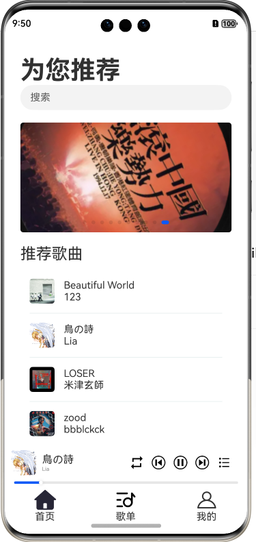

# 移动音乐播放应用-项目文档

项目开发文档见devlogs.md

## 一、项目概述

本项目是一个基于鸿蒙系统ArkTS的移动端音乐播放应用 ，为用户提供了登录注册、音乐播放、歌单管理等功能。

## 二、项目功能描述

1、登录注册

- 用户可以注册账户并登录，登录后即可使用歌曲服务。
- 用户可以在登录后退出登录。
- 每次登录时，会记住上次登录时的用户名

2、首页推荐

- 首页中展示了不同的推荐歌曲和歌单，用户可以播放首页中的歌曲或歌单

3、歌曲搜索

- 用户可以在搜索框中输入歌曲名称、作者或歌词来搜索歌曲
- 搜索的历史记录可以被保留，用户可以点击搜索记录快速搜索

4、歌曲播放

- 点击歌曲即可播放歌曲
- 可以拖动进度条来控制歌曲进度，可以设置暂停继续、下一首和上一首
- 可以设置播放顺序为顺序播放、随机播放、单曲循环

5、创建歌单

- 可以输入歌单名称，上传本地图片来创建歌单

6、收藏歌单

- 可以在首页的推荐歌单中选择歌单进行收藏

7、查看歌单

- 可以查看自己创建的歌单和收藏的歌单
- 可以查看歌单详情，包括其中的歌曲
- 可以删除自己创建的歌单或是取消收藏歌单

8、历史记录查看

- 歌曲播放后会产生历史记录
- 可以查看歌曲播放的历史记录，并播放其中的歌曲
- 可以删除历史记录

9、开屏广告

- 刚进入应用会出现五秒钟的广告
- 点击后会跳转至相应的广告页面

## 三、项目使用说明

1、开屏广告

- 用户刚打开应用时，会出现5秒钟的广告。
- 可以等待5秒钟或点击跳过广告来跳过广告
- 点击广告可以跳转至相应的广告方页面

2、登录注册页面

- 在存在账号时，可以输入用户名和密码，并点击登录按钮进行登录
- 点击“去注册”按钮，可以跳转至注册页面
- 注册页面填写用户名密码后，若登录成功则会返回登录页面
- 用户名中默认会显示上次登录使用的用户名

3、首页

- 登录后会自动进入首页。点击下方导航栏的最左侧图标也可以进入首页
- 用户可以点击页面中的歌曲进行播放
- 用户可以点击页面下方的推荐歌单，进入推荐歌单页面
- 点击上方的搜索框，可以进入到搜索页面

4、音乐播放栏

- 用户可以点击播放栏的歌曲，进入歌曲详情页面
- 点击播放栏右侧控制栏中最左侧的图标，可以切换播放顺序为顺序播放、随机播放、单曲循环
- 点击控制栏的左、中、右侧按钮，分别可以实现播放上一首、暂停继续、播放下一首
- 点击控制栏最右边按钮，可以显示当前歌曲播放列表

5、搜索歌曲

- 用户可以点击首页搜索框进入搜索页面
- 可以在搜索页上方的搜索栏中输入歌曲名称、歌手或歌词进行搜索
- 点击搜索按钮，即可跳转至搜索结果页面，展示搜索结果
- 完成搜索后，搜索页面会出现历史记录，点击历史记录可以快速进行搜索

6、歌单页面

- 用户可以点击下方导航栏的歌单图标进入歌单页面
- 歌单页面中会展示自建歌单和收藏歌单，点击上方导航栏中的一项即可展示对应内容
- 点击歌单可以跳转至歌单详情页面
- 点击右下角的“+”图标可以进入歌单创建页面

7、创建歌单

- 点击歌单页面右下角的“+”图标可以进入歌单创建页面
- 用户可以输入新建歌单的名称
- 点击选择图片，会进入图片选择页面，选择一张图片后点击确定即可返回并使用这张图片作为歌单封面
- 点击创建按钮即可创建歌单

8、歌单详情页面

- 点击一个歌单项可以进入歌单详情页面，其中会展示歌单中所有的歌曲
- 点击歌单封面下方的播放按钮，可以创建播放列表并播放歌单中的歌曲
- 如果是自己创建的歌单，那么可以点击歌曲右侧的“-”图标来从歌单中删除歌曲
- 如果是自己创建的歌单，那么可以点击右上角的“×”图标来删除歌单
- 如果是自己收藏的歌单，那么可以点击右上角的五角星来取消收藏歌单

9、我的页面

- 点击底部导航栏的“我的”图标可以进入我的页面，其中会展示自己的信息以及最近播放歌曲
- 点击最近播放歌曲可以进行歌曲的播放
- 点击右上角的退出登录可以退出当前登录状态
- 右滑历史记录，会出现删除按钮，点击删除按钮即可删除该历史记录

